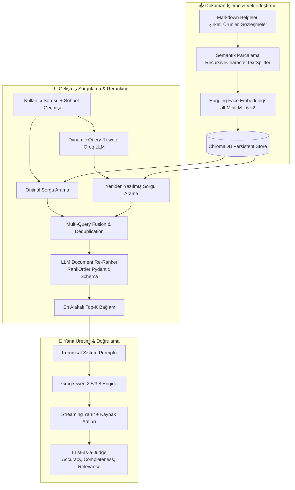

# 🛡️ InsuRAG — Enterprise InsurTech Intelligence & RAG Platform

<div align="center">

[](https://python.org)
[](https://groq.com)
[](https://huggingface.co)
[](https://trychroma.com)
[](https://gradio.app)
[](https://docs.astral.sh/uv/)

**Bir sonraki nesil kurumsal sigortacılık bilgi asistanı ve gelişmiş RAG (Retrieval-Augmented Generation) optimizasyon & benchmark platformu.**

[Öne Çıkan Özellikler](#-öne-çıkan-özellikler) •
[Mimari Tasarım](#-mimari-tasarım) •
[Kurulum & Başlangıç](#-kurulum--hızlı-başlangıç) •
[Boru Hatları (Pipelines)](#-rag-boru-hatları) •
[Evaluation & Benchmark](#-kapsamlı-değerlendirme-evaluation-suite) •
[Arayüzler](#-interaktif-arayüzler)

</div>

---

## 🌟 Projeye Genel Bakış

**InsuRAG**, modern kurumsal sigortacılık ekosistemleri (*Insurellm*) için tasarlanmış; şirket politikalarından reasürans anlaşmalarına, çalışan detaylarından ürün şartnamelerine kadar binlerce sayfalık karmaşık dökümantasyonu milisaniyeler içerisinde doğru, tutarlı ve halüsinasyonsuz yanıtlayan yapay zeka destekli bir RAG platformudur.

Sıradan "vektör ara ve modele sor" yaklaşımının ötesine geçerek; **Dynamic Query Rewriting (Sorgu Yeniden Yazımı)**, **Multi-Query Fusion**, **Cross-Encoder / LLM Re-Ranking** ve **LLM-as-a-Judge** otomatik doğrulama metriklerini bir araya getirir.

---

## 🚀 Öne Çıkan Özellikler

- ⚡ **Ultra Hızlı Groq Çıkarımı:** Qwen 2.5 / Qwen 3.8 modelleri ile milisaniyeler mertebesinde akışkan (streaming) yanıt üretimi.
- 🎯 **Açık Kaynak Hugging Face Embeddings:** `sentence-transformers/all-MiniLM-L6-v2` ile tamamen yerel, gizlilik odaklı ve maliyetsiz 384 boyutlu vektör temsilleri.
- 🧠 **Çift Boru Hattı Mimarisi:**
  - *Baseline Pipeline:* LangChain ve Chroma tabanlı standart RAG mimarisi.
  - *Advanced High-Level Pipeline:* Dinamik bağlamsal sorgu genişletme, çoklu sorgu birleştirme ve Pydantic şemalı LLM Re-ranker.
- 📊 **Bilimsel Değerlendirme (Evaluation Suite):**
  - **MRR (Mean Reciprocal Rank)**, **nDCG (Normalized Discounted Cumulative Gain)** ve **Keyword Coverage** ile bilgi getirme başarısı.
  - **LLM-as-a-Judge** ile Accuracy, Completeness ve Relevance kriterlerinde 1-5 arası objektif puanlama.
- 🎨 **Çift Kurumsal Gradio Arayüzü:**
  - `app.py`: Canlı streaming sohbet, bilgi tabanı istatistikleri ve prompt mühendisliği konsolu.
  - `evaulator.py`: Canlı renk kodlu metrik göstergeleri ve benchmark izleme dashboard'u.

---

## 🏗️ Mimari Tasarım



---

## 📂 Proje Dizin Yapısı

```bash
llm-lab/
├── app.py                      # Kurumsal Gradio Sohbet Portalı & İstatistikler
├── evaulator.py                # İnteraktif Benchmark & Değerlendirme Dashboard'u
├── main.py                     # Hızlı başlangıç kontrol betiği
├── pyproject.toml & uv.lock    # Hızlı ve deterministik paket bağımlılıkları
├── .env.example                # Örnek çevre değişkenleri şablonu
│
├── implementation/             # 🟢 Temel (Baseline) RAG Uygulaması
│   ├── answer.py               # Chroma + HuggingFace + Groq temel RAG motoru
│   └── ingest.py               # Belgeleri parçalama ve Chroma'ya indeksleme
│
├── high_level_implementation/  # 🚀 İleri Düzey (Advanced) RAG Uygulaması
│   ├── __init__.py
│   ├── answer.py               # Query Rewriter + Multi-Query + Re-Ranker + Fallback
│   └── ingestion.py            # Yapılandırılmış LLM chunking & embeddings
│
├── evaluation/                 # 📈 Kapsamlı Benchmark & Test Paketi
│   ├── __init__.py
│   ├── eval.py                 # MRR, nDCG ve LLM-as-a-judge hesaplama motoru
│   ├── test.py                 # Pydantic veri modelleri (TestQuestion, AnswerEval)
│   └── tests.jsonl             # 150 adet etiketli altın referans test senaryosu
│
└── notebooks/ (1-4.ipynb)      # 🧪 Adım Adım Ar-Ge ve Öğrenim Defterleri
    ├── 1.ipynb                 # Groq LLM & Temel İletişim
    ├── 2.ipynb                 # Chunking, Token Analizi & Vektörleştirme
    ├── 3.ipynb                 # RAG Birleştirme & Gradio İlk Tasarım
    └── 4.ipynb                 # Pipeline Evaluation & Benchmark Deneyleri
```

---

## ⚡ Kurulum & Hızlı Başlangıç

Bu proje ultra hızlı paket yöneticisi **`uv`** ile optimize edilmiştir.

### 1. Depoyu Klonlayın
```bash
git clone https://github.com/MustafaKocamann/InsuRAG.git
cd InsuRAG
```

### 2. Çevre Değişkenlerini Tanımlayın
`.env.example` dosyasını `.env` olarak kopyalayın ve Groq API anahtarınızı girin:
```bash
cp .env.example .env
```
`.env` içeriği:
```env
GROQ_API_KEY=gsk_your_groq_api_key_here
```

### 3. Bağımlılıkları Yükleyin
`uv` sanal ortamı ve gerekli tüm kütüphaneleri saniyeler içinde otomatik hazırlar:
```bash
uv sync
```

---

## 💻 Kullanım Senaryoları

### 🔹 1. Kurumsal Sohbet Portalı (`app.py`)
Müşteri temsilcisi veya sigorta uzmanı gibi Insurellm dokümanlarını akıcı bir arayüzle sorgulamak için:
```bash
uv run app.py
```
👉 Tarayıcınızda açın: `http://127.0.0.1:7860`

### 🔹 2. İnteraktif Evaluation Dashboard (`evaulator.py`)
RAG sisteminin MRR, nDCG ve doğruluk puanlarını canlı renkli kartlar ve grafiklerle izlemek için:
```bash
uv run evaulator.py
```

### 🔹 3. Terminalden Tekil Test Koşumu (CLI)
Belirli bir test numarasını (0-149) komut satırından anında incelemek için:
```bash
uv run evaluation/eval.py 0
```
*Örnek Çıktı:*
```text
================================================================================
Test #0: Who won the prestigious IIOTY award in 2023?
================================================================================
Retrieval Evaluation -> MRR: 0.6667 | nDCG: 0.6667 | Coverage: 66.7%
Answer Evaluation    -> Accuracy: 5.00/5 | Completeness: 5.00/5 | Relevance: 5.00/5
================================================================================
```

---

## 🔬 RAG Boru Hatları: Baseline vs. Advanced

| Yetenek | Baseline (`implementation/`) | Advanced (`high_level_implementation/`) |
| :--- | :---: | :---: |
| **Embeddings** | Hugging Face `all-MiniLM-L6-v2` | Hugging Face `all-MiniLM-L6-v2` |
| **LLM Motoru** | Groq ChatGroq (`qwen3.8-27b`) | Groq LiteLLM (`qwen3.8-27b`) |
| **Sorgu İşleme** | Ham / Doğrudan Metin | **Dynamic LLM Query Rewriting** |
| **Retrieval Stratejisi** | Tekil Benzerlik Araması (k=5) | **Çoklu Sorgu Füzyonu (k=20)** |
| **Yeniden Sıralama** | ❌ Yok | **✅ LLM Cross-Ranking (`RankOrder`)** |
| **Hata Toleransı** | Temel `try/except` | **Tenacity Retry + Akıllı Fallback** |

---

## 📊 Kapsamlı Değerlendirme (Evaluation Suite)

RAG sisteminin başarısı iki temel aşamada ölçülür:

### 1. Retrieval (Bilgi Getirme) Başarısı
- **MRR (Mean Reciprocal Rank):** Doğru anahtar kelimeleri içeren dökümanların listede kaçıncı sırada geldiğini ölçer.
- **nDCG (Normalized Discounted Cumulative Gain):** En değerli dökümanların en üstte yer almasını ödüllendirir.
- **Keyword Coverage:** Beklenen anahtar kelimelerin top-k sonuçlarda bulunma oranı.

### 2. Answer (Üretim) Kalitesi — LLM as a Judge
Groq üzerindeki hakem LLM, üretilen yanıtı altın referans yanıtla (`tests.jsonl`) kıyaslayarak değerlendirir:
- 🎯 **Accuracy (1-5):** Yanıt olgusal olarak ne kadar doğru?
- 📦 **Completeness (1-5):** Referanstaki kritik tüm detayları içeriyor mu?
- 🎯 **Relevance (1-5):** Soruya doğrudan cevap verip gereksiz laf kalabalığından kaçınıyor mu?

---

## 🛡️ Güvenlik & Veri Gizliliği

- Ham bilgi tabanı dokümanları (`knowledge-base/`) ve yerel vektör önbellekleri (`vector_db/`, `preprocessed_db/`) repodan izole edilmiştir (`.gitignore`).
- API anahtarları kesinlikle kod tabanına gömülmez; `.env` üzerinden yönetilir.
- Vektörleştirme işlemi yerel Hugging Face modeli ile gerçekleştirildiği için belgeler harici embedding API'larına sızmaz.

---

## 🤝 Katkıda Bulunma

1. Bu depoyu Fork'layın (`Fork`).
2. Yeni bir özellik dalı açın (`git checkout -b feature/amazing-feature`).
3. Değişikliklerinizi commit edin (`git commit -m 'feat: Add amazing feature'`).
4. Dalınıza push edin (`git push origin feature/amazing-feature`).
5. Bir **Pull Request** oluşturun.

---

<div align="center">
Geliştirici: <b>Mustafa Kocaman</b> • <a href="https://github.com/MustafaKocamann/InsuRAG">InsuRAG GitHub Repository</a>
</div>
